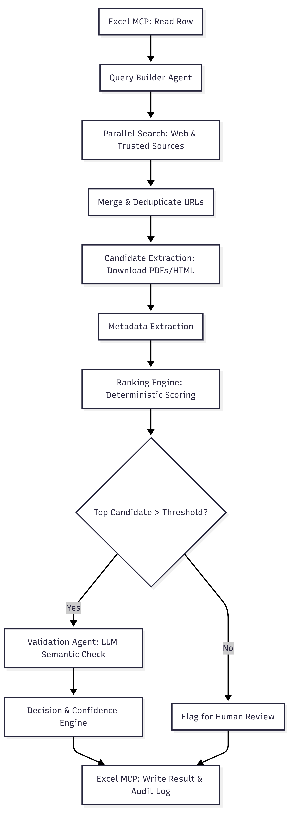

# L2 SDS Intelligence

L2 SDS Intelligence is an agentic AI system for chemical Safety Data Sheet (SDS) discovery, document parsing, multi-stage compliance verification, and spreadsheet batch processing. It pairs an autonomous LangGraph state machine with an isolated FastMCP tool boundary over stdio, an application-level SSRF defense shield, and a React command center to automate SDS retrieval while preventing unsupported or fabricated URLs.

<div align="center">

[](https://www.python.org/downloads/)
[](https://fastapi.tiangolo.com/)
[](https://www.langchain.com/langgraph)
[](https://docs.pydantic.dev/)
[-green.svg)](https://github.com/jlowin/fastmcp)
[](https://reactjs.org/)
[](https://www.typescriptlang.org/)
[](https://tailwindcss.com/)

</div>

---

## 1. Project Overview

* **What it is**: An intelligent retrieval and verification platform that automates finding, inspecting, and cataloging chemical Safety Data Sheets (SDS).
* **What it does**: Ingests chemical procurement requests from single queries or enterprise Excel workbooks, dynamically selects search queries, fetches candidate PDF/HTML documents from the public web, extracts standard GHS sections, independently verifies manufacturer and product identity, and updates client spreadsheets with grounded links, confidence scores, and audit reasoning.
* **Who it is for**: Environmental Health & Safety (EHS) officers, chemical procurement teams, regulatory compliance analysts, and facility safety managers maintaining hazardous material inventories.
* **What outcome it produces**: Grounded, verified SDS document links with confidence scores and reasoning citations. The architecture is designed to prevent unsupported or fabricated SDS URLs through live retrieval, raw document inspection, grounding checks, and deterministic verification gates.

---

## 2. Problem Statement

Maintaining compliant Safety Data Sheet libraries across enterprise inventories presents significant operational friction:

* **Chemical Name Ambiguity**: Substances exist under commercial trade names, technical synonyms, and abbreviations (e.g. *Acetone* vs. *2-Propanone*; *Isopropyl Alcohol* vs. *Isopropanol*), alongside concentration qualifiers (e.g. *Ethanol 200 Proof*, *Hydrochloric Acid 37%*).
* **Manufacturer Mismatch**: Third-party aggregators (ChemicalBook, GuideChem, etc.) host outdated or competitor datasheets that do not satisfy manufacturer-specific compliance audits.
* **Jurisdiction & Language Divergence**: Section 15 regulatory standards diverge significantly between the US (OSHA / 29 CFR 1910.1200 / TSCA), Canada (WHMIS), and the EU/UK (REACH / CLP). Global operations require documents in specific local languages.
* **Incorrect Document Types**: Search results frequently return Technical Data Sheets (TDS), Certificates of Analysis (CoA), or marketing brochures instead of authentic 16-section Safety Data Sheets.
* **Manual Excel Overhead**: Compliance analysts spend hours manually searching web engines, opening PDFs, reading Section 1, and pasting links back into multi-sheet spreadsheets.
* **Network & SSRF Risks**: Automated document downloading from arbitrary search links exposes systems to Server-Side Request Forgery, loopback access, and cloud metadata harvesting.
* **Unreliable Generative AI Links**: Standard generative LLMs hallucinate plausible-looking URLs that result in broken 404 links or point to incorrect chemicals.

---

## 3. Why This Project Exists

Traditional automated approaches fail because:
* **Keyword Search Alone is Insufficient**: Standard search queries prioritize SEO-optimized aggregators, marketing portals, or distributor directories above official manufacturer PDFs.
* **Static Scraping is Fragile**: Chemical manufacturer portals frequently update their layouts, authentication barriers, and URL routing structures.
* **LLMs Alone Cannot Be Trusted**: Generative models frequently fabricate non-existent links when asked to provide document URLs.

### Core Principle: "Retrieval Before Generation"
The platform enforces a strict architectural invariant: **Retrieval Before Generation**. The system never generates document links from model memory. Compliance verdicts and document links are derived strictly from raw text extracted from real documents downloaded from the web, and every verdict must pass an **independent programmatic verification stage** before being accepted.

---

## 4. Solution

The platform executes an automated 8-step pipeline:

```text
User / Excel Request
        │
        ▼
[1] Request Normalization ──► Maps headers semantically (e.g. "Product Product Name" -> product)
        │
        ▼
[2] Dynamic Action Selection ──► Policy engine evaluates state; chooses SEARCH, RANK, FETCH, RETRY, or FINISH
        │
        ▼
[3] Targeted Search Retrieval ──► Executes DuckDuckGo query; prioritizes official manufacturer domains
        │
        ▼
[4] Candidate Ranking (Stage A) ──► Scores candidates (0-100) using chemical synonyms and domain rules
        │
        ▼
[5] Isolated Document Fetching ──► Downloads document behind FastMCP subprocess boundary with SSRF shield
        │
        ▼
[6] Text & Section Extraction ──► In-memory PyMuPDF / BeautifulSoup parses 16 GHS sections, CAS numbers
        │
        ▼
[7] Independent Verification ──► Programmatic gate verifies evidence match, domain validity, grounding
        │
        ▼
[8] Schema Validation & Update ──► Pydantic validation; FastMCP writes in-place to Excel; UI updates
```

---

## 5. Key Features

Every feature listed below is verified and active in the codebase:

* **Agentic Search Query Execution**: Validated model-selected queries are passed directly to the search engine and preserved in search provenance.
* **Adaptive Model-Driven RETRY**: Tracks previous queries in state and automatically formulates distinct alternative search strategies (using CAS numbers, catalog IDs, or broader tokens) to prevent duplicate search loops.
* **Heuristic Candidate Ranking**: Stage A scoring (0–100) evaluates product synonyms, official manufacturer domains, direct PDF formats, and applies penalties to aggregator domains.
* **Independent Reflection & Verification**: Dedicated verification stage ([`perform_verification` in src/workflow.py](src/workflow.py)) re-checks raw document text tokens independently, avoiding reliance on LLM self-evaluation.
* **Strict Grounding Invariant**: `EXACT MATCH` and `BEST AVAILABLE` verdicts require non-empty, successfully fetched URLs. Any ungrounded candidate is automatically downgraded to `NEEDS REVIEW` with an empty URL.
* **FastMCP Subprocess Boundary**: Model Context Protocol server runs as a quarantined child process over stdio transport, isolating external document parsing and spreadsheet mutations.
* **Dynamic Protocol Tool Discovery**: `SDSMCPClient` queries available tools at runtime via `list_tools()` and verifies their presence before execution.
* **Multi-Page SDS Extraction Engine**: In-memory PyMuPDF (`fitz`) parser extracts text from up to 10 pages; regex patterns extract standard 16 GHS sections, CAS numbers, and dates.
* **Enterprise Excel Multi-Dataset Processing**: Ingests multi-sheet workbooks, classifies worksheets (`SDS_REQUESTS`, `SUPPORTING_DATA`, `SUMMARY`), and allows selecting a single active request sheet without unintended dataset merging.
* **SSRF Network Shield**: Pre-flight DNS resolution, private IP network blocking (RFC 1918), cloud metadata protection (`169.254.169.254`), loopback filtering, per-hop redirect checks, and 10MB chunked downloads.
* **Multi-Class Evaluation Benchmark**: 15-case ground truth dataset ([`data/ground_truth.json`](data/ground_truth.json)) testing positive matches, negative cases, ambiguous formulations, and security rejections.
* **Audit Telemetry & Traceability**: Comprehensive execution traces appended to [`logs/agent_trace.jsonl`](logs/agent_trace.jsonl) recording action sequences, policy latency, and verification results.
* **React Command Center UI**: Dark enterprise interface with live batch progress, single search inspection, audit history, and a compliance review queue.

---

## 6. End-to-End Workflow

The runtime pipeline processes each chemical request through deterministic stages:
1. **Request Ingestion**: Semantic column mapping maps arbitrary headers (e.g. `Product Product Name` → `product`).
2. **State Initialization**: LangGraph seeds the `SDSState` dictionary with empty pools, fetch caches, and budgets.
3. **Action Decision**: `decide_action_node` evaluates state, consults the LLM policy or deterministic rules, and applies prerequisite guards.
4. **Execution Nodes**: Depending on the decision, the agent branches to `search_node`, `rank_node`, `fetch_node`, or `draft_decision_node`.
5. **Document Verification**: `verify_decision_node` evaluates raw document text against request parameters and enforces grounding rules.
6. **Corrective Routing**: If issues are identified, `corrective_action_node` downgrades status and clears ungrounded URLs.
7. **Writeback & Logging**: FastMCP writes results in-place to the target Excel sheet; telemetry is appended to `logs/agent_trace.jsonl`.

For deep implementation details, state transition schemas, and node routing logic, refer to:
[System Flow](docs/SYSTEM_FLOW.md)

---

## 7. Architecture

The system operates across four decoupled architectural layers:

```text
┌────────────────────────────────────────────────────────────────────────┐
│                        TIER 1: PRESENTATION                            │
│           React 18 + TypeScript + Vite 6 + Tailwind CSS                │
│    (Dashboard, Single Search, Batch Processing, Review Queue, Trace)   │
└───────────────────────────────────┬────────────────────────────────────┘
                                    │ HTTP REST / Vite Proxy (/api)
                                    ▼
┌────────────────────────────────────────────────────────────────────────┐
│                        TIER 2: BACKEND API                             │
│                         FastAPI (server.py)                            │
│    (BatchJobManager, Workbook Inspection, Audit Endpoints, CORS)       │
└───────────────────────────────────┬────────────────────────────────────┘
                                    │ Async Graph Invocation (ainvoke)
                                    ▼
┌────────────────────────────────────────────────────────────────────────┐
│                    TIER 3: AGENTIC ORCHESTRATION                       │
│              LangGraph StateGraph Engine (src/workflow.py)             │
│    (decide_action -> search -> rank -> fetch -> draft -> verify)       │
└───────────────────────────────────┬────────────────────────────────────┘
                                    │ FastMCP Protocol (Stdio Transport)
                                    ▼
┌────────────────────────────────────────────────────────────────────────┐
│                   TIER 4: ISOLATED FASTMCP BOUNDARY                    │
│                        FastMCP (src/mcp_server.py)                     │
│    (Dynamic Tool Discovery, Excel In-Place Updates, Document Inspect)  │
└────────────────────────────────────────────────────────────────────────┘
```



For detailed architectural schematics, state transitions, security defenses, and component breakdown, see:
[Detailed Architecture](docs/ARCHITECTURE.md)

---

## 8. Frontend

The frontend is located in [`frontend/`](frontend) and provides an interactive command center for compliance operators:

* **Technologies**: React 18.3, TypeScript 5.6, Vite 6, Tailwind CSS 3.4, TanStack React Query 5.62, Recharts 2.15, Lucide React icons.
* **Capabilities**:
  * **Dashboard**: Displays overall query counts, status breakdown (exact match, best available, needs review), confidence metrics, and latency charts.
  * **Single Search**: Provides ad-hoc chemical lookups with real-time progress steps, color-coded result cards, direct PDF download links, and an expandable provenance drawer.
  * **Batch Processing**: Primary workflow supporting drag-and-drop workbook upload, multi-sheet dataset detection, column mapping confirmation, live progress bars, and Excel export.
  * **Review Queue**: Lists requests flagged as `NEEDS REVIEW`, categorized by root cause (`WRONG_PRODUCT`, `WRONG_MANUFACTURER`, `SECURITY_REJECTION`, etc.) with detailed failure explanations.
  * **Audit History & Trace**: Searchable table of past executions with raw message inspectors and LangGraph execution traces.

---

## 9. Backend

The backend is built with FastAPI and organized into modular components. Every source file and its core responsibility is outlined below:

| File | Responsibility |
|---|---|
| [server.py](server.py) | FastAPI REST API layer, thread-safe `BatchJobManager`, and audit endpoints |
| [src/workflow.py](src/workflow.py) | LangGraph StateGraph, LLM policy engine, prerequisite guards, and independent verification |
| [src/state.py](src/state.py) | Central LangGraph state schema definition (`SDSState`) |
| [src/schema.py](src/schema.py) | Pydantic v2 data models, grounding validators, and status literal schemas |
| [src/mcp_client.py](src/mcp_client.py) | FastMCP client managing stdio transport and dynamic tool discovery (`list_tools`) |
| [src/mcp_server.py](src/mcp_server.py) | FastMCP server subprocess exposing Excel I/O and sandboxed document inspection |
| [src/security.py](src/security.py) | SSRF network shield, DNS validation, private IP blocking, and safe redirect handler |
| [src/sds_parser.py](src/sds_parser.py) | In-memory binary PDF parsing (PyMuPDF), HTML parsing, GHS section regex, CAS extraction |
| [src/tools.py](src/tools.py) | DuckDuckGo search retrieval, Stage A heuristic ranking, and Stage B document scoring |
| [src/workbook_utils.py](src/workbook_utils.py) | Excel structure analysis, sheet classification, and semantic column mapping |
| [src/evaluation.py](src/evaluation.py) | Independent benchmark evaluation engine and markdown report generator |
| [main.py](main.py) | CLI batch runner connecting MCP client and LangGraph StateGraph |
| [evaluate.py](evaluate.py) | Benchmark evaluation CLI entrypoint |

---

## 10. AI / LLM Layer

* **Role of the LLM**: The LLM serves as an adaptive **policy engine** inside `decide_action_node`. It evaluates current observations, search history, and unvisited candidates to select the next discrete action (`SEARCH`, `RANK`, `FETCH`, `RETRY`, `FINISH`).
* **Model Configuration**: Uses Groq Cloud API (`langchain-groq`) running `openai/gpt-oss-120b` at temperature `0` for deterministic structured output.
* **Structured Output Validation**: Invoked via `.with_structured_output(ActionDecision)`. The resulting Pydantic model is validated by deterministic code before any action is executed.
* **Deterministic Guards**: If the LLM proposes an invalid action (e.g. attempting to fetch when no URLs exist, or retrying when budgets are spent), deterministic code safely repairs or redirects the action.
* **Fallback Behavior**: If `GROQ_API_KEY` is not provided or rate limits occur, the system automatically falls back to deterministic rule-based action selection without crashing.
* **Hard Execution Bounds**: The agent is restricted to a maximum of 20 graph recursions, 3 candidate fetches, 6 action iterations, and 2 retries per chemical request.

For technical deep-dive questions, see:
[Technical Guide](docs/TECHNICAL_GUIDE.md)

---

## 11. MCP Architecture

* **What MCP is**: The **Model Context Protocol (MCP)** is an open standard defining how AI applications interact with external tools and storage backends.
* **Why Used**: FastMCP provides **process isolation**. Untrusted document fetching (downloading external PDFs and running binary parsers) runs in a separate child process over stdio pipes, preventing external crashes or parser exploits from affecting the main application.
* **Stdio Transport**: Client and server communicate over standard input/output pipes using framed JSON-RPC messages without opening TCP ports.
* **Dynamic Tool Discovery**: Upon connection, `SDSMCPClient` queries the server using `list_tools()` to discover available tool definitions and schemas dynamically before invocation.
* **Registered Tools**:
  1. `get_pending_requests`: Reads target rows with automated sheet classification and semantic column mapping.
  2. `update_request_status`: Writes verified status, grounded URL, confidence, and reasoning back into Excel in-place.
  3. `inspect_sds_document`: Safely downloads and parses candidate documents behind the MCP boundary with SSRF protection.

---

## 12. Security

The platform implements an application-level **SSRF (Server-Side Request Forgery) Network Shield** in [`src/security.py`](src/security.py):

* **Scheme & Syntax Validation**: Only `http` and `https` schemes permitted; URL length bounded (8–2048 chars).
* **Domain Filtering**: Blocks loopback hostnames (`localhost`, `127.0.0.1`), cloud metadata endpoints (`metadata.google.internal`, `instance-data`), and internal suffixes (`.local`, `.internal`, `.lan`, `.corp`).
* **Pre-Flight DNS Resolution**: Resolves hostname to all IP addresses via `socket.getaddrinfo` before establishing network connections.
* **Subnet Filtering (`ipaddress.ip_network`)**: Inspects every resolved IP against blocked ranges:
  * IPv4 Loopback (`127.0.0.0/8`)
  * RFC 1918 Private Ranges (`10.0.0.0/8`, `172.16.0.0/12`, `192.168.0.0/16`)
  * Cloud Metadata & Link-Local (`169.254.0.0/16` for AWS, GCP, Azure)
  * Carrier-Grade NAT (`100.64.0.0/10`)
  * IPv6 Loopback (`::1/128`) and Unique Local (`fc00::/7`)
* **Per-Hop Redirect Validation**: Custom `SafeRedirectHandler` validates every HTTP redirect hop (max 5 hops) against SSRF policies.
* **Bounded Chunked Streaming**: Downloads data in 64 KB chunks, enforcing a strict 10 MB maximum limit (`MAX_DOCUMENT_SIZE_BYTES`) to prevent memory exhaustion.

---

## 13. Document & Excel Processing

### Document Processing ([src/sds_parser.py](src/sds_parser.py))
* **PDF Parsing via PyMuPDF (`fitz`)**: Reads in-memory byte buffers directly; extracts text from up to 10 pages (`max_pdf_pages=10`).
* **HTML Parsing via BeautifulSoup4**: Decomposes script, style, nav, and footer elements to extract visible body text from web portals.
* **16 GHS Section Detection**: Applies regex patterns to split documents into standard sections (Section 1 Identification, Section 2 Hazards, Section 3 Composition, Section 14 Transport, Section 15 Regulatory, etc.).
* **Entity Extraction**: Regular expressions extract CAS numbers (`\b[1-9]\d{1,6}-\d{2}-\d\b`), catalog/part numbers, revision dates, and supplier information.
* **Language & Jurisdiction Detection**: Detects language from body text markers (German, French, Spanish, Italian, Dutch, English) and jurisdiction from Section 15 regulatory standards (OSHA, WHMIS, REACH/CLP).

### Excel Batch Processing ([src/workbook_utils.py](src/workbook_utils.py))
* **Workbook Structure Analysis**: Scans all worksheets and detects table header offsets within the first 8 rows.
* **Sheet Classification**: Classifies sheets as `SDS_REQUESTS` (chemical requests), `SUPPORTING_DATA` (allocations/rosters), or `SUMMARY` (KPIs/pivots).
* **Single Active Dataset Contract**: Multiple candidate request sheets are detected without merging; users select one active sheet to process.
* **Semantic Column Mapping**: Maps arbitrary headers to standard fields (`product`, `company`, `part_number`, `country`, `language`, etc.) using `COLUMN_SYNONYMS`.
* **In-Place Modification**: `openpyxl` writes `Found URL`, `Status`, `Confidence`, and `Reasoning` directly to target rows without altering existing formulas or formatting.

---

## 14. Evaluation

### Benchmark Methodology ([src/evaluation.py](src/evaluation.py))
The evaluation runner ([`evaluate.py`](evaluate.py)) tests the retrieval pipeline against a multi-class ground truth dataset ([`data/ground_truth.json`](data/ground_truth.json)):

* **15 Benchmark Cases**:
  * **Positive Exact Match Cases**: Standard chemicals (Acetone, Isopropyl Alcohol, Sulfuric Acid, Methanol, Toluene) from official manufacturers (Sigma-Aldrich, Fisher Scientific, Merck, Thermo Fisher, Honeywell).
  * **Positive Best Available Cases**: Concentration grades and secondary distributor portals (Hydrochloric Acid 37%, Ethanol 200 Proof).
  * **Negative & Abstention Cases**: Missing product names, fictional chemicals (*Kryptonite Tetrafluoride*), non-existent manufacturers (*FictionalBio Labs*), unsupported jurisdictions (*Antarctica*), unsupported languages (*Esperanto*), uncataloged reagents, ambiguous mixtures, and SSRF injection attempts (`http://127.0.0.1:8000/sds.pdf`).
* **Strict Non-Circular Rules**:
  * `EXACT MATCH`, `BEST AVAILABLE`, and `NEEDS REVIEW` are evaluated strictly without interchangeable scoring.
  * URLs must match `acceptable_domains` via netloc or `acceptable_urls`. Generic keyword matching is prohibited.
  * Negative cases must return `NEEDS REVIEW` with an empty URL (`""`) to pass.

> **Distinction Between Methodology and Historical Results**: The evaluation suite defines the automated benchmark methodology. Historical test runs are recorded in `logs/evaluation_runs/`. The latest generated report is available in [docs/evaluation_report.md](docs/evaluation_report.md).

---

## 15. Tech Stack

| Technology | Category | Purpose |
|---|---|---|
| **Python 3.10+** | Backend | Core runtime for workflow, security, and evaluation |
| **FastAPI 0.110+** | Backend API | High-performance asynchronous REST API framework |
| **Uvicorn 0.28+** | Backend API | ASGI web server running the FastAPI application |
| **LangGraph 0.0.30+** | AI / Workflow | Stateful cyclic agent graph orchestration and routing |
| **LangChain Core 0.3+** | AI / Workflow | Base message abstractions and tool interfaces |
| **LangChain Groq 0.1+** | AI / Workflow | Inference client for Groq Cloud API (`openai/gpt-oss-120b`) |
| **Pydantic 2.7+** | Data Validation | Runtime schema enforcement, type coercion, and grounding invariants |
| **FastMCP (mcp <2.0)** | MCP Boundary | Model Context Protocol implementation over stdio transport |
| **ddgs 9.0+** | Retrieval | DuckDuckGo web search API client |
| **PyMuPDF (fitz) 1.23+** | Document Processing | In-memory binary PDF parsing and text extraction (up to 10 pages) |
| **BeautifulSoup4 4.12+** | Document Processing | HTML structure decomposition and text extraction |
| **openpyxl 3.1+** | Data Processing | In-place reading and writing of Excel `.xlsx` files |
| **pandas 2.0+** | Data Processing | Tabular structure analysis and header offset detection |
| **React 18.3** | Frontend | Declarative component UI for the command center |
| **TypeScript 5.6** | Frontend | Compile-time type safety across frontend services |
| **Vite 6.0** | Frontend Build | Build bundler, dev server, and `/api` reverse proxy |
| **Tailwind CSS 3.4** | Frontend Styling | Dark enterprise command center design system |
| **TanStack React Query 5.62** | Frontend State | Asynchronous server state caching and batch progress polling |
| **Recharts 2.15** | Data Visualization | SVG charts for status distribution and latency metrics |
| **Lucide React 0.460** | Frontend Icons | Enterprise iconography |
| **python-dotenv 1.0+** | Configuration | Reads environment variables from `.env` |
| **pytest 8.0+** | Testing | Unit, integration, and security test runner |
| **JSONL** | Telemetry | Append-only structured audit trail (`logs/agent_trace.jsonl`) |

---

## 16. Project Structure

```text
/
├── README.md                      # Project presentation & evaluation document
├── server.py                      # FastAPI REST API & BatchJobManager orchestrator
├── main.py                        # CLI batch runner (LangGraph + FastMCP stdio)
├── evaluate.py                    # Independent benchmark evaluation runner
├── create_test_data.py            # Generates synthetic sample_requests_eval.xlsx
├── sample_requests_eval.xlsx      # Default benchmark chemical workbook
├── requirements.txt               # Pinned backend dependencies
├── requirements-lock.txt          # Locked dependency manifest
├── pytest.ini                     # Pytest configuration
├── .env.example                   # Environment configuration template
├── .gitignore                     # Git ignore policies
│
├── src/                           # Backend application modules
│   ├── workflow.py                # LangGraph StateGraph, policy engine, verification
│   ├── state.py                   # SDSState schema (TypedDict)
│   ├── schema.py                  # Pydantic v2 validation models
│   ├── security.py                # SSRF network shield, DNS/IP checks, redirect handler
│   ├── sds_parser.py              # In-memory PDF & HTML parser, GHS section regex
│   ├── tools.py                   # DuckDuckGo search, Stage A & B scoring
│   ├── workbook_utils.py          # Sheet classification, semantic column mapping
│   ├── mcp_client.py              # FastMCP client with dynamic tool discovery
│   ├── mcp_server.py              # FastMCP server over stdio (Excel & doc inspect)
│   └── evaluation.py              # Benchmark evaluation suite engine
│
├── frontend/                      # React command center application
│   ├── package.json               # Frontend dependencies & scripts
│   ├── package-lock.json          # Locked frontend dependencies
│   ├── vite.config.ts             # Vite config with /api -> 127.0.0.1:8000 proxy
│   ├── tailwind.config.js         # Dark theme color tokens
│   ├── tsconfig.json              # TypeScript compiler configuration
│   ├── .env.example               # Frontend environment template
│   └── src/                       # React components, pages, hooks, services
│
├── docs/                          # Technical documentation
│   ├── ARCHITECTURE.md            # Detailed architecture specification
│   ├── TECHNICAL_GUIDE.md         # Deep-dive study guide (7 core questions)
│   ├── SYSTEM_FLOW.md             # Stage-by-stage runtime flow reference
│   ├── FINAL_VERIFICATION_REPORT.md # Prior verification report
│   ├── MENTOR_REMEDIATION_REPORT.md # Prior mentor review report
│   ├── evaluation_report.md       # Latest benchmark evaluation report
│   └── arch.png                   # Architecture schematic diagram
│
├── data/
│   └── ground_truth.json          # 15 multi-class benchmark evaluation cases
│
└── tests/                         # Automated test suite (91 test cases)
```

---

## 17. Setup & Running

### 17.1 Installation

1. **Backend Dependencies**:
   ```bash
   python -m venv .venv
   # Windows:
   .venv\Scripts\activate
   # Linux/macOS:
   source .venv/bin/activate

   pip install -r requirements.txt
   ```

2. **Frontend Dependencies**:
   ```bash
   cd frontend
   npm install
   cd ..
   ```

### 17.2 Configuration

1. Copy `.env.example` to `.env`:
   ```bash
   cp .env.example .env
   ```
2. (Optional) Set your Groq API key:
   ```ini
   GROQ_API_KEY=your_groq_api_key_here
   GROQ_MODEL=openai/gpt-oss-120b
   ```
   *Note: If no API key is provided, the backend operates using its deterministic rule-based fallback policy.*

3. Copy `frontend/.env.example` to `frontend/.env`:
   ```bash
   cp frontend/.env.example frontend/.env
   ```

### 17.3 Running the Application

* **Start the Backend Server**:
  ```bash
  python server.py
  ```
  Runs at `http://127.0.0.1:8000` (OpenAPI documentation at `http://127.0.0.1:8000/docs`).

* **Start the Frontend Command Center**:
  ```bash
  cd frontend
  npm run dev
  ```
  Runs at `http://127.0.0.1:5173`. Proxies `/api/*` requests to the backend on port 8000.

* **Run the Evaluation Benchmark**:
  ```bash
  python evaluate.py
  ```
  Runs the 15-case test suite and outputs results to [docs/evaluation_report.md](docs/evaluation_report.md).

* **Run the Batch CLI Runner Directly**:
  ```bash
  python main.py
  ```

---

## 18. Design Decisions

| Architectural Decision | Rationale |
|---|---|
| **LLM as Adaptive Policy Engine** | Chemical queries vary widely in phrasing, trade names, and formats. An LLM dynamically selects targeted queries and evaluates candidates where static if-else trees fail. |
| **Pydantic Structured Output** | Prevents unparsable conversational output by forcing the model into strict Pydantic schemas (`ActionDecision`, `VerificationResult`). |
| **Deterministic Prerequisite Guards** | LLMs can propose invalid actions. Deterministic code enforces physical prerequisites before actions execute, safely repairing or redirecting choices. |
| **FastMCP Stdio Subprocess Boundary** | Quarantines untrusted binary PDF parsing and web HTML extraction in an isolated child process, protecting the main application from crashes. |
| **Independent Programmatic Verification** | Self-grading LLMs exhibit confirmation bias. A separate verification gate re-checks raw text tokens against ground truth parameters without trusting model self-reports. |
| **Application-Level SSRF Protection** | Pre-flight DNS resolution and private/cloud IP blocking prevent internal network probing or cloud metadata theft regardless of deployment infrastructure. |
| **Retrieval Before Generation Invariant** | Eliminates URL hallucination by requiring positive verdicts to contain non-empty URLs that were verified in search provenance and fetched successfully. |

---

## 19. Limitations

* **Search Engine Rate Limits**: DuckDuckGo search (`ddgs`) can throttle or trigger CAPTCHAs during rapid, high-volume consecutive queries (>50 requests within minutes).
* **Text-Layer PDF Parsing (No OCR)**: PyMuPDF extracts embedded text streams. Scanned legacy bitmap PDFs lacking an underlying digital text layer cannot be parsed without an OCR engine.
* **External LLM Provider Dependency**: Autonomous policy selection requires access to the Groq Cloud API. When API keys are missing, the system operates on deterministic fallback rules.
* **Single-Worker In-Memory Batch Manager**: `BatchJobManager` operates in-process with `asyncio.Lock()`. It is designed for single-node deployment rather than a distributed Celery/Redis queue.

---

## 20. Future Goals

### Currently Implemented
* Dynamic LangGraph StateGraph action selection with prerequisite guards.
* Model-selected query execution and adaptive retry query formulation.
* Independent reflection and programmatic verification stage.
* Strict grounding invariant enforcement (zero ungrounded positive verdicts).
* FastMCP server and client over stdio transport with dynamic tool discovery.
* In-memory PDF text extraction and 16 GHS section detection via PyMuPDF.
* Enterprise multi-sheet Excel ingestion, sheet classification, and in-place updates.
* Multi-tier SSRF network shield with pre-flight DNS and private IP filtering.
* 15-case evaluation benchmark with automated markdown report generation.
* React 18 / TypeScript / Tailwind CSS command center UI.

### Future / Planned
* **Optical Character Recognition (OCR)**: Integration of Tesseract or AWS Textract for scanned legacy chemical datasheets lacking digital text layers.
* **Distributed Task Queue**: Migration of `BatchJobManager` to a Celery/Redis queue for multi-node horizontal scaling.
* **ERP Webhook Integration**: Webhook triggers integrating directly with SAP EHSM and Oracle ERP procurement workflows.
* **Multi-Model Consensus Validation**: Dual-LLM reflection combining independent models from different providers for critical high-hazard reviews.

---

## 21. Evaluation Talking Points

1. **Retrieval Before Generation**: The system never asks the LLM to invent document links from memory. It retrieves candidate documents on the public web, downloads them safely, parses real text sections, and verifies the raw text.
2. **SSRF Defense Shield**: Before any network connection is opened, `src/security.py` resolves hostnames via `socket.getaddrinfo` and checks every resolved IP against RFC 1918, loopback, and cloud metadata CIDRs. Redirects are validated on every single hop.
3. **Dynamic MCP Tool Discovery**: `SDSMCPClient` does not assume hardcoded tools. It negotiates tools dynamically with `src/mcp_server.py` over the standard Model Context Protocol over stdio pipes, inspecting input schemas at runtime.
4. **Non-Circular Grounding Invariant**: In `src/workflow.py`, positive verdicts are rejected if the final URL was not discovered during search and fetched successfully. Negative cases (missing product, wrong manufacturer, SSRF attack) are forced to `NEEDS REVIEW` with an empty URL.
5. **Multi-Dataset Excel Contract**: In `src/workbook_utils.py`, multi-sheet workbooks are inspected structurally; supporting squad allocation sheets are separated from actual SDS requests, preventing data corruption.
6. **True Dynamic Actions**: `decide_action_node` evaluates observations to choose `SEARCH`, `RANK`, `FETCH`, `RETRY`, or `FINISH`. Prerequisite guards ensure the model cannot take illegal actions.
7. **Production Testing Foundation**: The repository contains 91 automated unit and integration tests covering security, schema validation, parsing, workflow routing, and MCP stdio roundtrips.
8. **Process Isolation**: Untrusted binary document parsing runs in an isolated FastMCP subprocess, preventing crashes from impacting the primary web API.
9. **Two-Stage Scoring Engine**: Combines Stage A search metadata scoring (chemical synonyms, manufacturer domain bonus, aggregator penalty) with Stage B document-first evidence scoring (Section 1 and Section 3 GHS verification).
10. **Clear Audit Provenance**: Every execution trace captures policy latencies, LLM versus fallback policy sources, executed queries, and verification discrepancy reasons in `logs/agent_trace.jsonl`.
